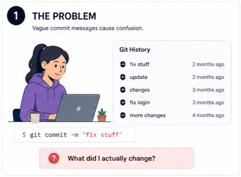
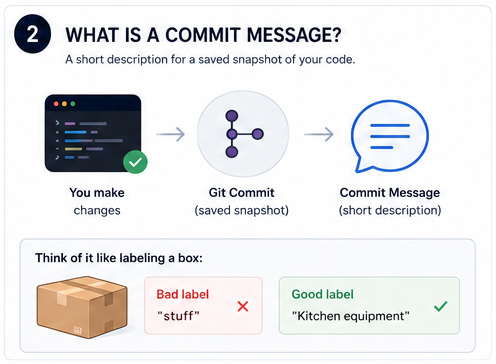
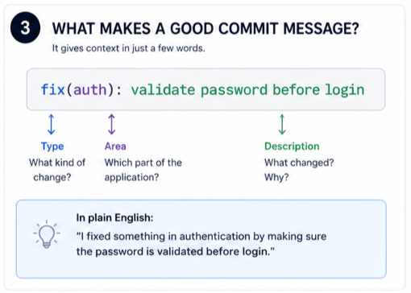
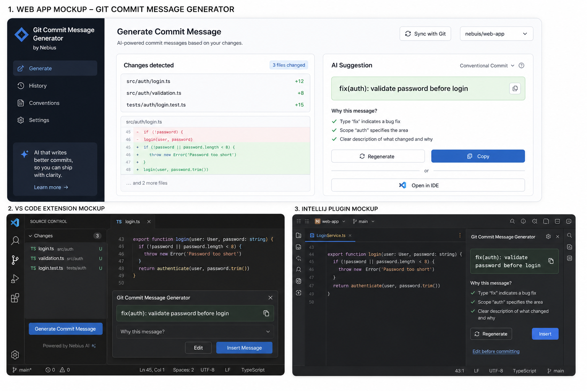
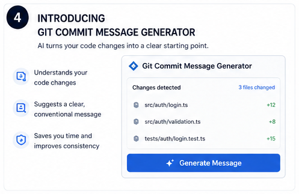
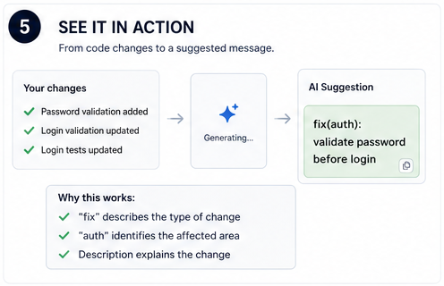
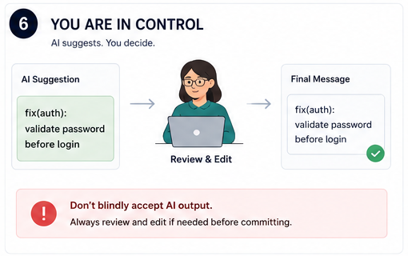
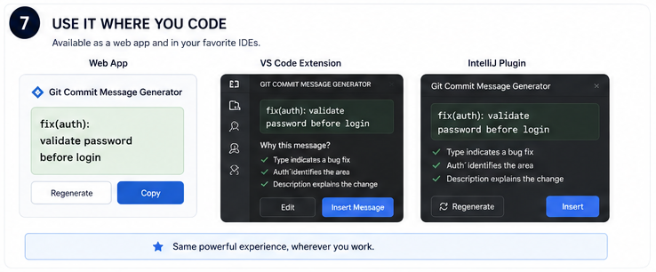
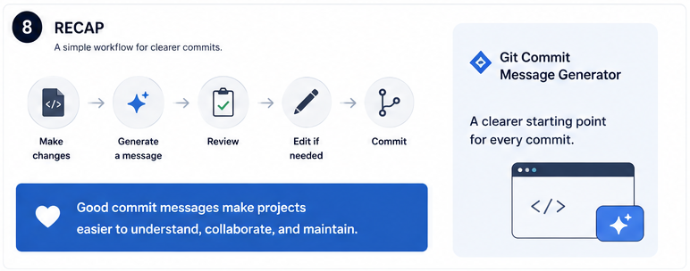

# Git Commit Message Generator
## 3–5 Minute Learning Experience

**Audience:** Junior developers  
**Format:** Script + Visual Storyboard  
**Estimated duration:** 3–5 minutes

---

## Learning Objectives

By the end of this lesson, learners will be able to:

- Explain why clear commit messages matter.
- Recognize the basic structure of a conventional commit.
- Use Git Commit Message Generator to generate a message from their code changes.
- Review and edit the generated message before committing.

---

## 1. Start with the problem

### Script

"Let's start with something you may have already seen in a project.

You open the Git history and find commits called `fix stuff`, `update`, or just `changes`.

You know something happened, but you don't really know what.

That's a problem because your Git history isn't just a record of changes. It's also a source of context for everyone working on the project — including you when you come back to the code months later.

So the goal isn't just to make a commit. **It's to make the commit history useful.**"

---

## 2. Understand the commit message

### Script

"Before we use the tool, let's take a quick look at what a commit message actually does.

When you make changes and create a Git commit, Git saves a snapshot of those changes. The commit message gives that snapshot a short description.

Think of it like labeling a box.

If the label says `stuff`, you don't know what's inside. If it says `Kitchen equipment`, you immediately have some useful context.

Commit messages work the same way.

You don't need to describe every line of code. You just need to give the change a clear and useful label."

---

## 3. What makes a good commit message?

### Script

"Here's a simple example:

`fix(auth): validate password before login`

There are three useful pieces here.

`fix` tells us the type of change.

`auth` tells us which part of the application is affected.

And `validate password before login` tells us what changed.

Now compare that with something like `fix login`.

It's shorter, but it doesn't give us nearly as much context.

A good commit message should be **short enough to scan and specific enough to understand.**"

---

## 4. Meet Git Commit Message Generator

### Script

"Now let's say you've finished your changes and you're ready to commit, but you're staring at the commit box wondering how to describe everything you just did.

This is where Git Commit Message Generator can help.

It looks at your code changes and suggests a clear, conventional commit message.

You can use it through the web app or directly in environments like VS Code and IntelliJ.

So instead of starting with a blank box, you have a useful first draft to work from.

Let's see how that works."

---

## 5. Generate a message from your changes

### Script

"Here, the tool has detected changes across the authentication and login code.

Instead of asking us to describe every changed file ourselves, it uses those changes as context and generates a suggested commit message.

This is useful because we don't have to start from scratch.

We get a first draft based on the work we've actually done, and now we can decide whether it's a good description of that work."

---

## 6. Understand the suggestion

### Script

"The generator suggests:

`fix(auth): validate password before login`

Let's break that down.

`fix` identifies the type of change.

`auth` identifies the area of the application that changed.

And `validate password before login` describes what the change does.

Notice that the message focuses on the purpose of the change, not just the name of a file.

That's what makes a commit message useful when someone is scanning the Git history later.

And if you're still learning conventional commits, seeing the reasoning behind the suggestion can help you recognize the pattern yourself."

---

## 7. Review before you commit

### Script

"Now here's the most important part.

**Don't blindly accept the AI suggestion.**

The generator gives you a starting point, but you make the final decision.

Before committing, ask yourself three questions:

Does this accurately describe my change?

Is the scope correct?

Would another developer understand this message six months from now?

If it looks good, keep it.

If something is missing or inaccurate, edit it.

The tool helps with the first draft. **You provide the judgment.**"

---

## 8. Use it where you already code

### Script

"Once you know the workflow, you don't have to change the way you develop.

Git Commit Message Generator can fit into the environments you already use.

Whether you're working in the web app, VS Code, or IntelliJ, the basic process stays the same:

Look at your changes, generate a suggestion, review it, and decide what you want to commit.

That means writing a better commit message doesn't have to become a separate task in your workflow."

---

## 9. Put it all together

### Script

"Let's put the whole process together.

First, **make your code changes.**

Then, **generate a commit message.**

Next, **review the suggestion.**

**Edit it if needed.**

And finally, **commit.**

The goal isn't to automate your judgment.

It's to make getting to a clear, conventional commit message faster and easier.

So the next time you're about to commit, don't settle for `fix stuff`.

Give your change a useful label — and let the generator help you get there."

---
## Try It on Your Next Commit

Before your next commit, take a few seconds to look at the message you're about to save.

Ask yourself:

"Could another developer understand what changed just by reading this?"

If the answer is no, improve it.

A useful conventional commit pattern to start with is:

`type(scope): description`

For example:

`fix(auth): validate password before login`

If you're not sure how to phrase it, use Git Commit Message Generator to get a starting point.

Then remember:

`Generate → Review → Edit if needed → Commit`

---

##  Key Takeaway

A good commit message isn't about writing more.

It's about giving the right amount of context to the person reading your Git history later.

Git Commit Message Generator helps you get to that starting point faster, while you stay responsible for the final message.

Generate the message. Review it. Make it yours. Then commit.

---

##  Instructional Design Approach

I designed this as a problem-first, demonstration-based lesson so junior developers understand why clear commit messages matter before being introduced to the product. The lesson then moves from the problem, to the fundamentals of a useful commit message, to a guided demonstration, and finally to a simple workflow learners can apply immediately.

I intentionally position the AI as a starting point rather than an authority, reinforcing the habit of reviewing generated output while showing how the product reduces friction in an existing developer workflow.

The sequence is concise enough for a 3–5 minute learning experience while still giving the learner a practical skill they can use immediately.
